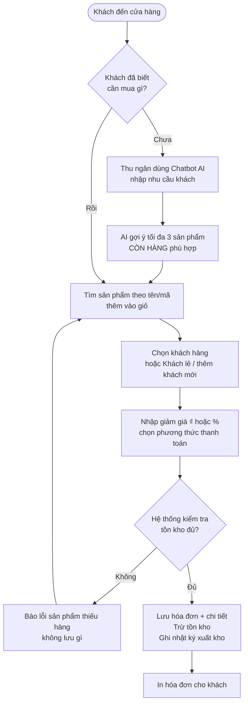
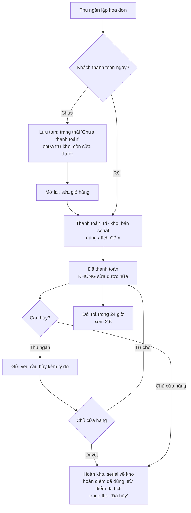
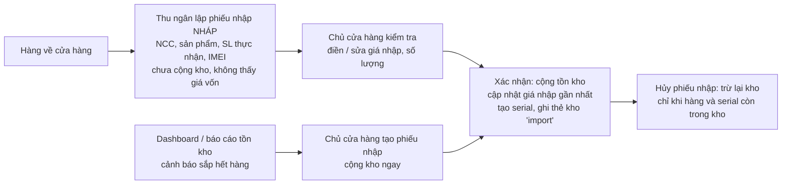
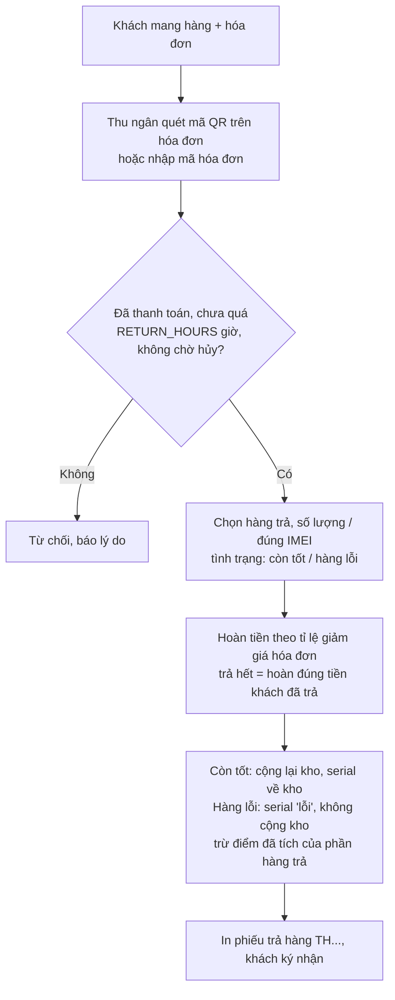
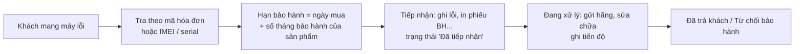
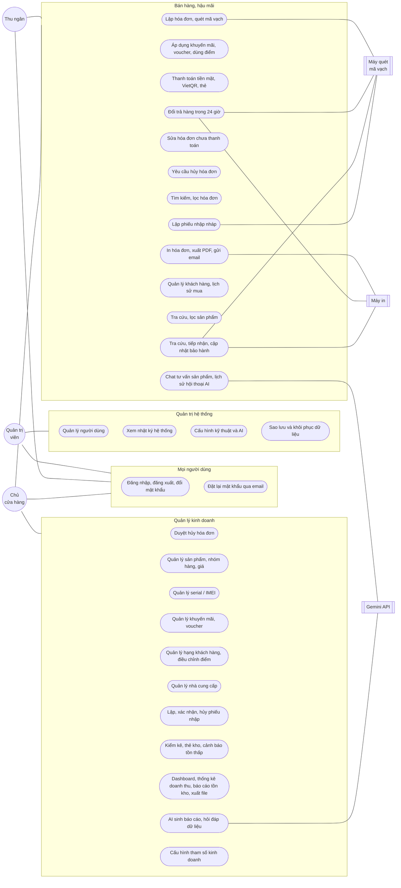
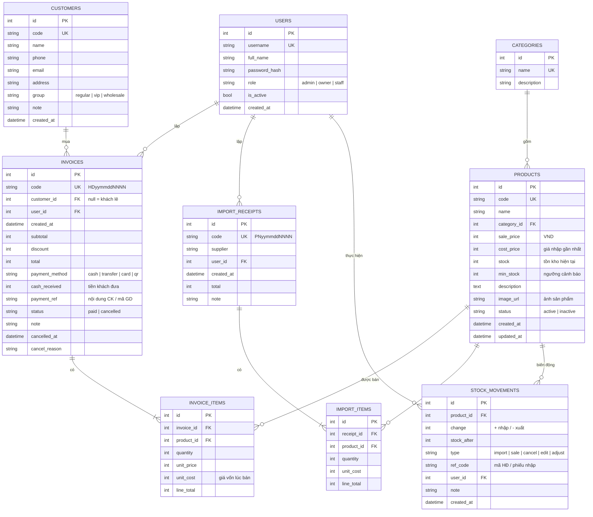
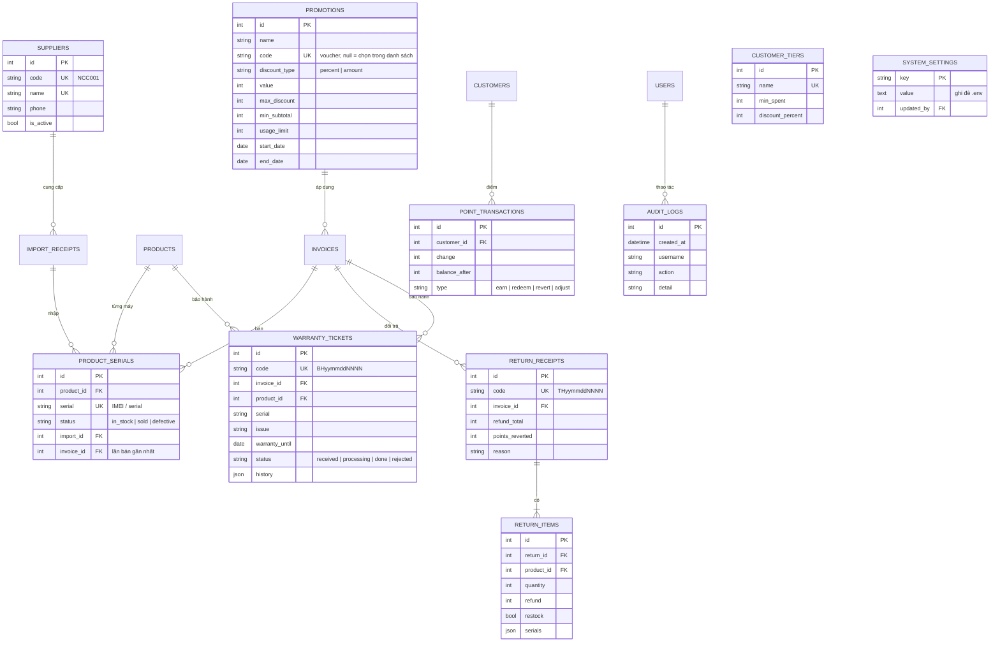
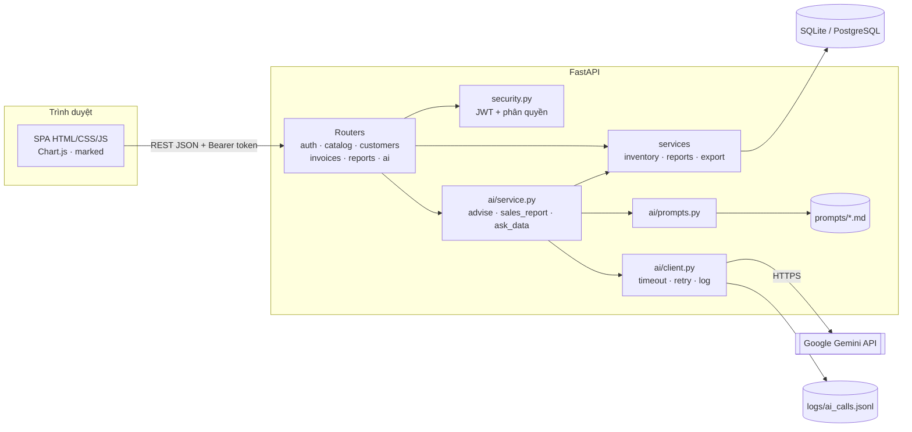
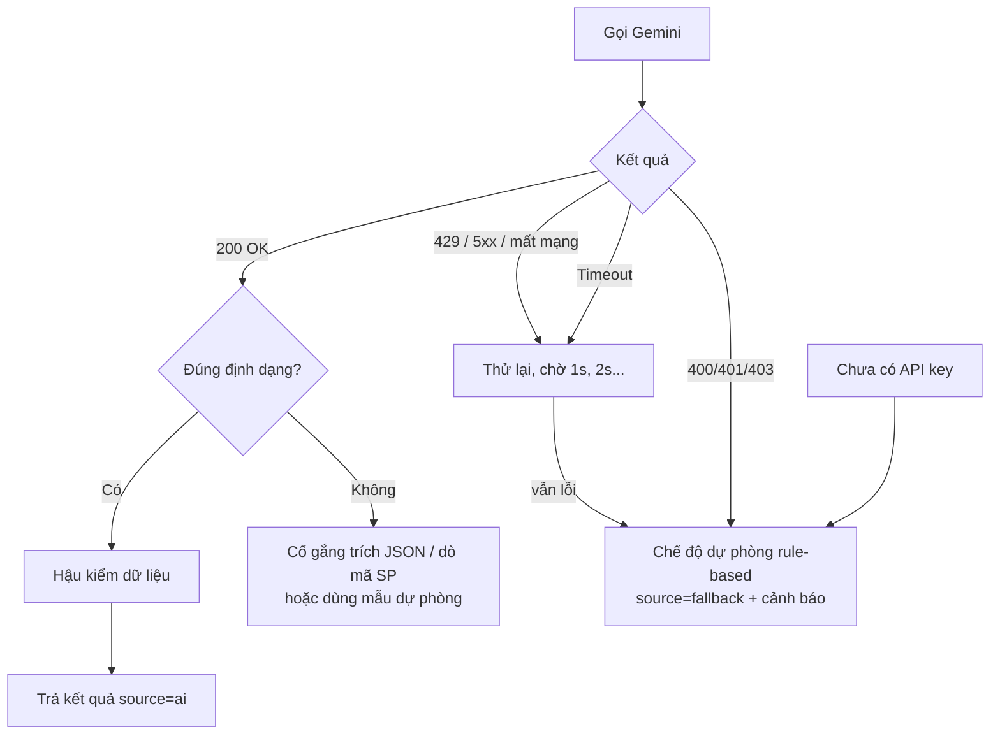

# Phân tích yêu cầu và thiết kế hệ thống (Bài KT1)

**Đề tài:** Hệ thống quản lý bán hàng có tích hợp AI (SalesAI)
**Công nghệ:** Python FastAPI · SQLAlchemy · SQLite (tương thích PostgreSQL/MySQL) · HTML/CSS/JavaScript · Google Gemini API

> Các sơ đồ viết bằng Mermaid. Xem trực tiếp trên GitHub/GitLab, VS Code (extension *Markdown Preview Mermaid Support*) hoặc dán vào https://mermaid.live để xuất ảnh đưa vào báo cáo.

---

## 1. Phạm vi hệ thống

Hệ thống phục vụ **một cửa hàng bán lẻ** (điện thoại, phụ kiện, thiết bị điện tử, gia dụng) với ba nhóm người dùng độc lập: quản trị viên, thu ngân, chủ cửa hàng. Hệ thống quản lý vòng đời hàng hóa: **nhập hàng → tồn kho → bán hàng (hóa đơn) → báo cáo**. AI tạo sinh được tích hợp ở ba điểm: tư vấn sản phẩm cho khách, sinh báo cáo doanh thu và hỏi đáp dữ liệu bằng ngôn ngữ tự nhiên.

**Ngoài phạm vi:** quản lý nhiều chi nhánh, tích hợp cổng thanh toán online, kế toán công nợ nhà cung cấp, bán hàng online/giao hàng.

---

## 2. Phân tích quy trình nghiệp vụ

### 2.1. Quy trình bán hàng và lập hóa đơn



**Quy tắc nghiệp vụ:**
- BR1: Tổng tiền = Σ(số lượng × đơn giá) − giảm giá. Giảm giá ≤ tạm tính.
- BR2: Không bán vượt tồn kho; sản phẩm "ngừng kinh doanh" không bán được.
- BR3: Thu ngân không được tự sửa đơn giá; hệ thống dùng giá niêm yết.
- BR4: Lưu **giá vốn tại thời điểm bán** vào chi tiết hóa đơn để tính lãi gộp chính xác khi giá nhập thay đổi.
- BR5: Toàn bộ thao tác (lưu hóa đơn + trừ kho) nằm trong **một giao dịch**; lỗi ở bất kỳ dòng nào → rollback toàn bộ.
- BR8: Thanh toán tiền mặt: tiền khách đưa phải ≥ tổng tiền; hệ thống lưu lại và in tiền thừa trên hóa đơn.
- BR9: Thanh toán VietQR: mã QR chứa sẵn số tài khoản cửa hàng, số tiền và nội dung (SALESAI + thời điểm); thu ngân xác nhận đã nhận tiền thì hóa đơn mới được lưu. Nội dung được lưu vào `payment_ref` để đối soát với sao kê.

### 2.2. Quy trình hóa đơn tạm, hủy hóa đơn (có duyệt)



- BR6: Hóa đơn đã hủy không thể hủy lại; hóa đơn đã có phiếu đổi trả không hủy được (tránh hoàn kho hai lần).
- BR7: Chỉ sửa được hóa đơn **chưa thanh toán**. Hủy hóa đơn đã thanh toán: thu ngân gửi yêu cầu, **chủ cửa hàng duyệt**. Hóa đơn tạm: người lập hoặc chủ cửa hàng hủy ngay.
- BR10: Thu ngân không tự đặt giá, không tự giảm giá; chỉ áp dụng chương trình khuyến mãi / voucher do chủ cửa hàng tạo, giảm giá theo hạng thành viên và điểm tích lũy. Mỗi hóa đơn một chương trình hoặc một voucher.
- BR11: Sản phẩm quản lý theo IMEI / serial: nhập kho phải ghi đủ số máy, bán phải chọn đúng máy còn trong kho.

### 2.3. Quy trình nhập hàng



### 2.4. Quản lý tồn kho (nhập - xuất - tồn, thẻ kho)

Mọi thay đổi tồn kho đều đi qua **một hàm duy nhất** và ghi bảng `stock_movements` với loại: `import` (nhập), `sale` (bán), `cancel` (hủy HĐ), `return` (khách trả hàng), `import_cancel` (hủy phiếu nhập), `adjust` (kiểm kê). Nhờ đó có **thẻ kho** của từng sản phẩm (tồn đầu kỳ, nhập, xuất, tồn cuối kỳ). Tồn kho không bao giờ âm. Form sửa sản phẩm **không cho sửa trực tiếp tồn kho**; muốn thay đổi phải qua phiếu nhập hoặc "Kiểm kê" có ghi lý do.

### 2.5. Quy trình đổi trả hàng (trong 24 giờ)



- Doanh thu thuần của kỳ = tiền bán − tiền hoàn trả trong kỳ; giá vốn trừ phần hàng nhập lại kho.
- Đổi hàng = phiếu trả cho món cũ + hóa đơn mới cho món khách lấy.

### 2.6. Quy trình bảo hành



---

## 3. Tác nhân (Actor)

Ba tác nhân người dùng **độc lập, không kế thừa quyền của nhau** (quản trị viên không tự động có quyền nghiệp vụ, chủ cửa hàng không quản trị tài khoản).

| Actor | Mô tả | Chức năng |
|---|---|---|
| **Quản trị viên** (admin) | Quản trị hệ thống | Quản lý tài khoản, đặt lại mật khẩu, cấu hình kỹ thuật và AI, sao lưu / khôi phục dữ liệu, xem nhật ký hệ thống. **Không** bán hàng, **không** xem giá vốn và doanh thu |
| **Thu ngân** (staff) | Đứng quầy, phục vụ khách | Lập hóa đơn, quản lý khách hàng, nhận đổi trả và bảo hành, lập phiếu nhập nháp, tra cứu sản phẩm, dùng AI tư vấn |
| **Chủ cửa hàng** (owner) | Quản lý kinh doanh | Mọi nghiệp vụ của thu ngân, thêm quản lý sản phẩm, serial / IMEI, giá, khuyến mãi, hạng thành viên, điểm tích lũy, nhà cung cấp, nhập hàng, tồn kho, báo cáo, tham số kinh doanh, duyệt hủy hóa đơn và dùng toàn bộ AI |
| **Gemini API** (hệ thống ngoài) | Dịch vụ AI tạo sinh | Sinh câu tư vấn, nhận xét báo cáo, câu trả lời |
| **Máy quét mã vạch** (thiết bị) | Máy quét USB (giả lập bàn phím) hoặc camera | Quét mã sản phẩm, IMEI / serial khi bán và nhập hàng, mã QR trên hóa đơn khi đổi trả / bảo hành |
| **Máy in** (thiết bị) | Máy in nhiệt 80mm / máy in văn phòng | In hóa đơn, phiếu trả hàng, phiếu bảo hành, tem QR từ **trang in của trình duyệt** (không cần driver riêng) |

---

## 4. Use case

### 4.1. Sơ đồ use case



Chủ cửa hàng có **cùng nhóm use case Bán hàng, hậu mãi** với thu ngân (liệt kê trực tiếp, không phải kế thừa), cộng thêm nhóm Quản lý kinh doanh. Quản trị viên chỉ có nhóm Quản trị hệ thống.

### 4.2. Đặc tả use case chính

**UC2 – Lập hóa đơn bán hàng**

| Mục | Nội dung |
|---|---|
| Actor | Thu ngân, Chủ cửa hàng; máy quét mã vạch, máy in |
| Tiền điều kiện | Đã đăng nhập; có sản phẩm còn hàng |
| Luồng chính | 1. Mở màn hình Bán hàng → 2. Chọn sản phẩm hoặc quét mã vạch / IMEI (sản phẩm quản lý theo serial: chọn đúng máy) → 3. Chọn khách (tùy chọn; hệ thống tự giảm theo hạng thành viên) → 4. Chọn chương trình khuyến mãi hoặc nhập voucher, nhập số điểm muốn dùng → 5. Chọn phương thức thanh toán, bấm Thanh toán → 6. Hệ thống kiểm tra tồn kho / serial / voucher / điểm, lưu hóa đơn, trừ kho, tích điểm → 7. In hóa đơn (trang in trình duyệt), tải PDF hoặc gửi email |
| Luồng thay thế | 5a. Khách chưa thanh toán → **Lưu tạm** (chưa trừ kho), mở lại để sửa / thanh toán sau. 6a. Không đủ tồn kho, voucher hết hạn / hết lượt, đơn chưa đủ tối thiểu → báo lỗi, không lưu. 3a. Khách mới → thêm nhanh ngay trên màn hình bán. Chủ cửa hàng có thêm ô giảm giá tay |
| Hậu điều kiện | Hóa đơn "Đã thanh toán"; tồn kho giảm; serial chuyển "đã bán"; điểm khách được cộng / trừ; thẻ kho có bản ghi `sale` |

**UC15, UC30 – Yêu cầu hủy và duyệt hủy hóa đơn**

| Mục | Nội dung |
|---|---|
| Actor | Thu ngân (yêu cầu), Chủ cửa hàng (duyệt) |
| Luồng chính | 1. Thu ngân mở hóa đơn đã thanh toán → 2. Bấm Yêu cầu hủy, nhập lý do → 3. Hóa đơn chuyển "Chờ duyệt hủy", chủ cửa hàng thấy số yêu cầu cạnh menu Hóa đơn → 4. Chủ cửa hàng mở hóa đơn, bấm Duyệt hủy → 5. Hệ thống hoàn kho, trả serial về kho, hoàn điểm đã dùng, trừ điểm đã tích, ghi nhật ký hệ thống |
| Luồng thay thế | 4a. Từ chối hủy → hóa đơn giữ nguyên. 2a. Hóa đơn đã có phiếu đổi trả → không cho hủy |

**UC17 – Đổi trả hàng trong 24 giờ**

| Mục | Nội dung |
|---|---|
| Actor | Thu ngân, Chủ cửa hàng; máy quét mã vạch, máy in |
| Tiền điều kiện | Hóa đơn đã thanh toán, chưa quá thời hạn đổi trả (tham số `RETURN_HOURS`, mặc định 24 giờ), không đang chờ duyệt hủy |
| Luồng chính | 1. Quét mã QR trên hóa đơn / nhập mã → 2. Hệ thống hiện số lượng còn trả được từng dòng → 3. Chọn số lượng (hàng IMEI: chọn đúng máy), tình trạng hàng, lý do → 4. Hệ thống tính tiền hoàn theo tỉ lệ giảm giá, cộng lại kho hàng còn tốt, trừ điểm đã tích → 5. In phiếu trả hàng cho khách ký |
| Hậu điều kiện | Phiếu TH..., doanh thu thuần kỳ hiện tại giảm đúng số tiền hoàn |

**UC6 – Chatbot tư vấn sản phẩm**

| Mục | Nội dung |
|---|---|
| Actor | Thu ngân, Chủ cửa hàng; hệ thống ngoài Gemini API |
| Luồng chính | 1. Nhập nhu cầu khách ("tai nghe dưới 500k, pin lâu") → 2. Hệ thống lấy danh sách sản phẩm **đang bán và còn hàng** → 3. Ghép prompt từ `prompts/product_advisor_v3.md` → 4. Gọi Gemini, yêu cầu JSON → 5. Hậu kiểm: loại mã không tồn tại/hết hàng → 6. Hiển thị câu trả lời + thẻ sản phẩm (giá, tồn) + nút "Thêm vào giỏ" |
| Luồng thay thế | 4a. Timeout / rate limit / chưa có API key → tư vấn dự phòng theo từ khóa + ngân sách. 4b. Phản hồi không phải JSON → hiển thị văn bản, tự dò mã sản phẩm rồi hậu kiểm |

**UC13 – AI sinh báo cáo doanh thu**

| Mục | Nội dung |
|---|---|
| Actor | Chủ cửa hàng |
| Luồng chính | 1. Chọn kỳ báo cáo → 2. Hệ thống **tự tính** doanh thu, lãi gộp, so sánh kỳ trước, theo nhóm hàng, top bán chạy, bán chậm, sắp hết hàng → 3. Gửi JSON tổng hợp (không có thông tin cá nhân khách) cho AI → 4. AI viết báo cáo Markdown 5 mục cố định → 5. Hiển thị, cho sao chép/tải .md |
| Luồng thay thế | Không có hóa đơn → không gọi AI. AI lỗi / sai định dạng → báo cáo theo mẫu |

**UC14 – Hỏi đáp dữ liệu bán hàng**

| Mục | Nội dung |
|---|---|
| Actor | Chủ cửa hàng |
| Luồng chính | 1. Nhập câu hỏi ("Tháng này mặt hàng nào bán chậm?") → 2. Hệ thống nhận diện kỳ (hôm nay, hôm qua, 7 ngày, tháng này, tháng trước, tháng N, năm nay) → 3. Tính số liệu tổng hợp kỳ đó → 4. AI trả lời dựa trên số liệu → 5. Hiển thị kèm kỳ dữ liệu đã dùng |
| Thiết kế an toàn | **Không** cho AI sinh SQL chạy trực tiếp → không thể đọc/sửa dữ liệu ngoài phạm vi, không lộ dữ liệu cá nhân |

---

## 5. Yêu cầu chức năng

QTV = quản trị viên, TN = thu ngân, CCH = chủ cửa hàng.

| Mã | Yêu cầu | Vai trò | Trạng thái |
|---|---|---|---|
| FR01 | Đăng nhập, đăng xuất; token JWT hết hạn theo cấu hình (mặc định 8 giờ) | Tất cả | ✅ |
| FR02 | Đổi mật khẩu của chính mình | Tất cả | ✅ |
| FR03 | Đặt lại mật khẩu qua email (mã 6 số, 10 phút, dùng một lần, sai 5 lần thì hủy) | Tất cả (có email) | ✅ |
| FR04 | Quản lý người dùng: thêm, đổi vai trò, email, khóa, đặt lại mật khẩu, duyệt tài khoản tự đăng ký | QTV | ✅ |
| FR05 | Xem nhật ký hệ thống (đăng nhập, tài khoản, cấu hình, sao lưu, duyệt hủy, nhập kho...) và nhật ký gọi AI không kèm nội dung | QTV | ✅ |
| FR06 | Cấu hình kỹ thuật và AI: bật / tắt AI, model, mức suy nghĩ, timeout, thử lại, phiên bản prompt, hạn phiên | QTV | ✅ |
| FR07 | Sao lưu dữ liệu (tải file) và khôi phục từ file sao lưu | QTV | ✅ |
| FR08 | Cấu hình tham số kinh doanh: thông tin cửa hàng, tài khoản VietQR, điểm tích lũy, thời hạn đổi trả | CCH | ✅ |
| FR10 | CRUD nhóm hàng, sản phẩm (ảnh, giá bán, giá nhập, tồn tối thiểu, số tháng bảo hành, quản lý theo IMEI) | CCH | ✅ |
| FR11 | Quản lý serial / IMEI: tạo khi nhập kho, chọn khi bán, tra cứu, khai báo, đánh dấu lỗi | CCH (TN chọn khi bán) | ✅ |
| FR12 | Tra cứu, lọc sản phẩm (tên/mã, nhóm, còn/sắp hết/hết hàng, trạng thái) | TN, CCH | ✅ |
| FR13 | Quản lý khách hàng, xem lịch sử mua hàng, tổng chi tiêu | TN, CCH (xóa: CCH) | ✅ |
| FR14 | Quản lý hạng khách hàng (chi tiêu tối thiểu, % giảm tự động) | CCH | ✅ |
| FR15 | Tích điểm khi thanh toán, dùng điểm trừ tiền, điều chỉnh điểm có lý do | TN dùng điểm, CCH điều chỉnh | ✅ |
| FR16 | Quản lý khuyến mãi / voucher: %, số tiền, giảm tối đa, đơn tối thiểu, thời gian, số lượt | CCH | ✅ |
| FR17 | Lập hóa đơn, quét mã vạch / IMEI thêm sản phẩm, áp dụng khuyến mãi / voucher / điểm | TN, CCH | ✅ |
| FR18 | 4 phương thức thanh toán: tiền mặt (tiền thừa), chuyển khoản VietQR, quẹt thẻ POS, quét QR | TN, CCH | ✅ |
| FR19 | In hóa đơn từ trình duyệt (khổ 80mm, có mã QR tra cứu), xuất PDF, gửi email kèm PDF | TN, CCH | ✅ |
| FR20 | Lưu hóa đơn tạm, sửa và thanh toán hóa đơn chưa thanh toán | TN, CCH | ✅ |
| FR21 | Hủy hóa đơn: TN gửi yêu cầu, CCH duyệt / từ chối; hoàn kho, serial, điểm | TN yêu cầu, CCH duyệt | ✅ |
| FR22 | Tìm kiếm, lọc hóa đơn (TN chỉ thấy hóa đơn mình lập) | TN, CCH | ✅ |
| FR23 | Đổi trả hàng trong 24 giờ (tham số), hoàn tiền theo tỉ lệ, nhập lại kho / hàng lỗi, in phiếu trả | TN, CCH | ✅ |
| FR24 | Tra cứu bảo hành theo hóa đơn / IMEI, tiếp nhận, cập nhật tiến độ, in phiếu bảo hành | TN, CCH | ✅ |
| FR25 | Quản lý nhà cung cấp | CCH | ✅ |
| FR26 | Lập phiếu nhập nháp (chưa cộng kho, không thấy giá vốn) | TN, CCH | ✅ |
| FR27 | Lập phiếu nhập, xác nhận phiếu nháp, hủy phiếu nhập (trừ lại kho) | CCH | ✅ |
| FR28 | Cảnh báo tồn kho thấp, kiểm kê điều chỉnh tồn có lý do, thẻ kho từng sản phẩm, nhật ký nhập-xuất-tồn | CCH | ✅ |
| FR29 | Dashboard, thống kê doanh thu (thuần, đã trừ hoàn trả), lãi gộp, báo cáo tồn kho | CCH | ✅ |
| FR30 | Xuất báo cáo doanh thu, tồn kho, danh sách hóa đơn ra Excel, PDF, CSV | CCH | ✅ |
| FR31 | Chat tư vấn sản phẩm còn hàng, trợ lý đa năng theo quyền người hỏi | TN, CCH | ✅ |
| FR32 | AI sinh báo cáo doanh thu, hỏi đáp dữ liệu bán hàng | CCH | ✅ |
| FR33 | Xem, tìm, đổi tên, xóa lịch sử hội thoại AI (của chính mình) | TN, CCH | ✅ |

## 6. Yêu cầu phi chức năng

| Mã | Nhóm | Yêu cầu | Cách đáp ứng |
|---|---|---|---|
| NFR01 | Bảo mật | Mật khẩu không lưu dạng thô | bcrypt (12 vòng), mật khẩu băm theo cách cũ (PBKDF2) tự nâng cấp khi đăng nhập |
| NFR02 | Bảo mật | API key AI không lộ trong mã nguồn | Đặt trong `.env` (đã `.gitignore`), cung cấp `.env.example`; key gửi qua header, không ghi log |
| NFR03 | Bảo mật | Phân quyền ở phía server, vai trò độc lập | Mọi API khai báo danh sách vai trò bằng dependency `require_roles` (không có vai trò toàn quyền); giao diện chỉ ẩn menu cho tiện |
| NFR04 | Riêng tư | Không gửi dữ liệu nhạy cảm cho AI | Báo cáo/hỏi đáp chỉ gửi số liệu tổng hợp; không gửi tên, SĐT, dữ liệu thanh toán khách; có hàm `mask_phone` khi cần |
| NFR05 | Phân quyền dữ liệu | Mỗi vai trò chỉ thấy dữ liệu cần thiết | Thu ngân không xem giá nhập, chỉ xem hóa đơn mình lập, không xem báo cáo; quản trị viên không xem giá vốn, doanh thu (nhật ký gọi AI ẩn nội dung) |
| NFR15 | Kiểm toán | Truy vết thao tác quan trọng | Bảng `audit_logs`: đăng nhập (cả thất bại), tài khoản, cấu hình, sao lưu / khôi phục, duyệt hủy, nhập / hủy phiếu nhập, đổi giá, điều chỉnh điểm, kiểm kê |
| NFR16 | Sẵn sàng dữ liệu | Sao lưu / khôi phục | Sao lưu bằng backup API của SQLite (nhất quán khi đang chạy); khôi phục kiểm tra định dạng, bảng bắt buộc, `integrity_check`, phải có quản trị viên |
| NFR06 | Toàn vẹn | Tồn kho luôn đúng | Giao dịch nguyên tử, khóa dòng sản phẩm, nhật ký kho, không cho tồn âm |
| NFR07 | Tin cậy AI | AI lỗi không làm hỏng chức năng | Timeout, retry có backoff với 429/5xx, xử lý phản hồi sai định dạng, chế độ dự phòng rule-based |
| NFR08 | Hiệu năng | Thao tác quản lý < 1 giây với dữ liệu demo | Truy vấn tổng hợp bằng SQL, phân trang, index trên cột tìm kiếm |
| NFR09 | Khả dụng | Giao diện tiếng Việt, dùng được trên máy tính bảng/điện thoại | Layout responsive, menu thu gọn |
| NFR10 | Bảo trì | Prompt tách khỏi code | Thư mục `prompts/`, định dạng `### SYSTEM` / `### USER`, biến `{{ten_bien}}` |
| NFR11 | Kiểm thử | Có test tự động | 85 test pytest cho hóa đơn, tồn kho, báo cáo, AI, thanh toán, VietQR, ảnh (dùng AI giả, không cần mạng) |
| NFR13 | Bảo mật file | Ảnh tải lên không chứa mã độc | Kiểm tra bằng Pillow, chỉ nhận JPG/PNG/WEBP/GIF ≤ 5 MB, lưu lại thành WEBP với tên ngẫu nhiên (loại bỏ EXIF và nội dung lạ); không nhận SVG |
| NFR14 | Nhất quán giao diện | Mọi màn hình cùng một hệ thống thiết kế | Biến CSS dùng chung (màu, bo góc, chiều cao điều khiển 40px), một bộ icon SVG cùng nét, hàm `table()` và `thumb()` dùng cho mọi bảng và ảnh |
| NFR12 | Triển khai | Chạy local hoặc Docker | `uvicorn` hoặc `docker compose up` |

## 7. Ma trận phân quyền

Ba vai trò độc lập: mỗi API khai báo đúng danh sách vai trò được dùng (`require_roles`), không có vai trò "toàn quyền".

| Chức năng | Quản trị viên | Thu ngân | Chủ cửa hàng |
|---|:-:|:-:|:-:|
| Đăng nhập, đổi mật khẩu, quên mật khẩu qua email | ✅ | ✅ | ✅ |
| Quản lý người dùng, phân quyền | ✅ | ❌ | ❌ |
| Nhật ký hệ thống, cấu hình kỹ thuật và AI, sao lưu / khôi phục | ✅ | ❌ | ❌ |
| Bán hàng, lập hóa đơn, áp dụng khuyến mãi / voucher / điểm | ❌ | ✅ | ✅ |
| Giảm giá tay, đặt giá khác giá niêm yết | ❌ | ❌ | ✅ |
| Xem hóa đơn | ❌ | Chỉ HĐ của mình | Tất cả |
| Sửa hóa đơn chưa thanh toán | ❌ | HĐ của mình | ✅ |
| Hủy hóa đơn đã thanh toán | ❌ | Gửi yêu cầu | Duyệt / tự hủy |
| Đổi trả, bảo hành | ❌ | ✅ | ✅ |
| Xem sản phẩm | ❌ | ✅ (ẩn giá nhập) | ✅ |
| Thêm/sửa/xóa sản phẩm, nhóm hàng, giá, serial / IMEI | ❌ | ❌ | ✅ |
| Khách hàng: xem/thêm/sửa | ❌ | ✅ | ✅ |
| Xóa khách hàng, điều chỉnh điểm, hạng thành viên | ❌ | ❌ | ✅ |
| Khuyến mãi, voucher, nhà cung cấp, tham số kinh doanh | ❌ | ❌ | ✅ |
| Phiếu nhập nháp | ❌ | ✅ (không thấy giá vốn) | ✅ |
| Lập / xác nhận / hủy phiếu nhập, kiểm kê, thẻ kho | ❌ | ❌ | ✅ |
| Dashboard, báo cáo doanh thu / tồn kho, xuất file | ❌ | ❌ | ✅ |
| Trợ lý đa năng, chatbot tư vấn | ❌ | ✅ (công cụ giới hạn) | ✅ |
| AI báo cáo, hỏi đáp dữ liệu | ❌ | ❌ | ✅ |

---

## 8. Thiết kế cơ sở dữ liệu

### 8.1. ERD



### 8.1b. Bảng bổ sung cho phân quyền, hậu mãi, khách hàng thân thiết



Cột bổ sung trên bảng cũ: `users.email`; `products.warranty_months`, `products.track_serial`; `customers.points`;
`invoices.status` thêm `pending` (hóa đơn tạm), `tier_discount`, `promo_discount`, `points_used`, `points_discount`,
`points_earned`, `promotion_id`, `cancel_requested_at`, `cancel_requested_by`; `invoice_items.serials`;
`import_receipts.status` (`draft | completed | cancelled`), `supplier_id`, `confirmed_at`, `confirmed_by`, `cancelled_at`, `cancel_reason`;
`import_items.serials`. CSDL cũ được tự bổ sung cột khi khởi động (`ensure_schema`), không mất dữ liệu.

### 8.2. Các quyết định thiết kế

- **Tiền lưu kiểu số nguyên (VND)** thay vì số thực → tránh sai số làm tròn khi cộng dồn.
- **Không xóa cứng hóa đơn**: chỉ chuyển trạng thái `cancelled` để giữ lịch sử, báo cáo lọc theo `status = 'paid'`.
- **Sản phẩm đã phát sinh giao dịch** thì "xóa" = chuyển `inactive`, giữ toàn vẹn khóa ngoại với `invoice_items`.
- **`unit_cost` trong `invoice_items`** giúp lãi gộp của các kỳ cũ không thay đổi khi giá nhập tăng/giảm.
- **Bảng `stock_movements`** thay cho việc chỉ lưu con số tồn kho: vừa là nhật ký kiểm toán, vừa là dữ liệu "nhập - xuất - tồn".
- **Mã chứng từ** sinh theo ngày: `HD2609230001`, `PN2609230001`.

---

## 9. Kiến trúc hệ thống



**Cấu trúc thư mục:**

```
app/
  main.py            # khởi tạo FastAPI, mount giao diện
  config.py          # đọc .env
  database.py        # engine, session
  models.py          # ORM 9 bảng
  schemas.py         # kiểm tra dữ liệu vào (Pydantic)
  security.py        # băm mật khẩu, JWT, require_roles
  routers/           # API theo nhóm chức năng
  services/          # nghiệp vụ: inventory.py, reports.py, export.py
  ai/                # client.py (Gemini), prompts.py, service.py (3 chức năng AI)
prompts/             # prompt template tách riêng
static/              # giao diện
scripts/             # seed.py (dữ liệu mẫu), compare_prompts.py
tests/               # pytest
docs/                # tài liệu
```

---

## 10. Vị trí tích hợp AI

| # | Chức năng AI | Màn hình | Người dùng | Dữ liệu gửi cho AI | Đầu ra | Cơ chế kiểm soát |
|---|---|---|---|---|---|---|
| 1 | **Chatbot tư vấn sản phẩm** | Chatbot tư vấn (nút "Thêm vào giỏ" nối sang Bán hàng) | Thu ngân, Chủ cửa hàng | Nhu cầu khách + bảng sản phẩm **còn hàng** (mã, tên, nhóm, giá, tồn, mô tả) + 6 lượt hội thoại gần nhất | JSON `{answer, suggestions[{code, reason}]}` | Lọc trước (chỉ gửi hàng còn), JSON có cấu trúc, hậu kiểm loại mã sai/hết hàng, chống prompt injection trong quy tắc số 7 |
| 2 | **AI sinh báo cáo doanh thu** | AI báo cáo doanh thu | Chủ cửa hàng | JSON tổng hợp: doanh thu, lãi gộp, kỳ trước, theo nhóm, top/slow, sắp hết | Markdown 5 mục cố định | Số liệu do hệ thống tính, AI chỉ nhận xét; kiểm tra có tiêu đề `##`; không gửi dữ liệu cá nhân |
| 3 | **Hỏi đáp dữ liệu bán hàng** | Hỏi đáp dữ liệu | Chủ cửa hàng | Câu hỏi + JSON tổng hợp theo kỳ được nhận diện | Câu trả lời Markdown | Không text-to-SQL; AI chỉ thấy dữ liệu tổng hợp; nêu rõ kỳ dữ liệu |

**Vì sao không dùng RAG / text-to-SQL:** dữ liệu sản phẩm của cửa hàng nhỏ (vài chục đến vài trăm mặt hàng) vừa đủ nằm trong prompt; lọc bằng SQL trước khi gửi rẻ hơn và dễ kiểm soát hơn vector search. Text-to-SQL có rủi ro truy vấn sai, đọc bảng `users`/`customers`, hoặc tốn chi phí sửa lỗi SQL, nên không phù hợp với mức độ đề tài.

**Luồng xử lý lỗi AI:**



---

## 11. Wireframe

### 11.1. Màn hình bán hàng (POS)

```
┌──────────┬──────────────────────────────────────────────────────────────────────┐
│ SalesAI  │ Bán hàng                          [AI: gemini]     Nhân viên [Đăng xuất]│
│          ├──────────────────────────────────────────────┬───────────────────────┤
│ Bán hàng │ [🔍 Tìm tên / mã sản phẩm......] [Nhóm hàng ▾]│ GIỎ HÀNG              │
│ Hóa đơn  │ ┌────────┐ ┌────────┐ ┌────────┐ ┌────────┐   │ Khách: [tìm tên/SĐT][+]│
│ Khách    │ │PK001   │ │PK002   │ │PK003   │ │PK004   │   │ 👤 Phạm Minh Anh · VIP │
│ Sản phẩm │ │Tai nghe│ │Tai nghe│ │Sạc 20W │ │Tai nghe│   │ Tai nghe A1  [-]2[+]  │
│ Chatbot  │ │350.000₫│ │490.000₫│ │190.000₫│ │450.000₫│   │               700.000₫│
│          │ │Còn 50  │ │HẾT HÀNG│ │Còn 54  │ │Còn 33  │   │ Giảm giá [ 5 ][% ▾]   │
│          │ └────────┘ └────────┘ └────────┘ └────────┘   │ Thanh toán [Tiền mặt▾]│
│          │ ┌────────┐ ┌────────┐ ...                     │ Tạm tính     700.000₫ │
│          │                                               │ Giảm giá     -35.000₫ │
│          │                                               │ TỔNG CỘNG    665.000₫ │
│          │                                               │ [   💳 THANH TOÁN   ] │
└──────────┴───────────────────────────────────────────────┴───────────────────────┘
```

### 11.2. Màn hình quản lý sản phẩm

```
┌─────────────────────────────────────────────────────────────────────────────────┐
│ Sản phẩm                                                                          │
│ [Tìm tên/mã....] [Nhóm hàng ▾] [Tồn kho: Tất cả/Còn/Sắp hết/Hết ▾] [Trạng thái ▾]│
│ [Lọc]                                                      [+ Thêm sản phẩm]      │
├──────┬───────────────────────┬─────────┬──────────┬──────────┬──────┬─────────────┤
│ Mã   │ Tên sản phẩm          │ Nhóm    │ Giá bán  │ Giá nhập │ Tồn  │ Thao tác    │
├──────┼───────────────────────┼─────────┼──────────┼──────────┼──────┼─────────────┤
│PK001 │ Tai nghe Bluetooth A1 │ Phụ kiện│ 350.000  │ 220.000  │ (50) │[Sửa][Kiểm kho][Xóa]│
│PK002 │ Tai nghe A2 Pro       │ Phụ kiện│ 490.000  │ 310.000  │[Hết] │[Sửa][Kiểm kho][Xóa]│
├──────┴───────────────────────┴─────────┴──────────┴──────────┴──────┴─────────────┤
│ 26 bản ghi                                             [‹ Trước] Trang 1/2 [Sau ›] │
└─────────────────────────────────────────────────────────────────────────────────┘
```

### 11.3. Dashboard chủ cửa hàng

```
┌─────────────────────────────────────────────────────────────────────────────────┐
│ ┌─────────────┐ ┌─────────────┐ ┌─────────────┐ ┌─────────────┐ ┌─────────────┐  │
│ │DT hôm nay   │ │DT tháng này │ │Lãi gộp tháng│ │SP đang bán  │ │Cần nhập hàng│  │
│ │18.920.000₫  │ │281.172.400₫ │ │51.347.400₫  │ │25           │ │4            │  │
│ └─────────────┘ └─────────────┘ └─────────────┘ └─────────────┘ └─────────────┘  │
│ ┌───────────────────── Doanh thu 30 ngày (biểu đồ đường) ───────────────────────┐│
│ │      /\        /\                   /\                                          ││
│ │ ____/  \__/\__/  \____/\___________/  \___                                      ││
│ └────────────────────────────────────────────────────────────────────────────────┘│
│ ┌──── Top 5 bán chạy ──────────────┐ ┌──── Sắp hết hàng ─────────────────────────┐│
│ │ Tai nghe A1     27   9.450.000₫  │ │ PK002 Tai nghe A2 Pro     0 / 5          ││
│ │ Sạc 20W         27   5.130.000₫  │ │ DT003 iPhone 13           0 / 2          ││
│ └──────────────────────────────────┘ │ [🚚 Tạo phiếu nhập]                      ││
│                                       └──────────────────────────────────────────┘│
└─────────────────────────────────────────────────────────────────────────────────┘
```

### 11.4. Chatbot tư vấn

```
┌─────────────────────────────────────────────────────────────────────────────────┐
│ Trợ lý chỉ tư vấn sản phẩm CÒN HÀNG.        Prompt [v3 ▾] [Cuộc trò chuyện mới] │
│ (Tai nghe dưới 500k pin lâu) (Loa chống nước) (Pin dự phòng sạc laptop)          │
│                                   ┌───────────────────────────────────────────┐ │
│                                   │ Khách cần tai nghe dưới 500k, pin lâu     │ │
│                                   └───────────────────────────────────────────┘ │
│ ┌──────────────────────────────────────────────┐                               │
│ │ Mình gợi ý 2 mẫu còn hàng phù hợp:            │                               │
│ │ ┌──────────────────────────────────────────┐ │                               │
│ │ │ Tai nghe Bluetooth Sport S5 (PK004)       │ │                               │
│ │ │ 450.000₫ · Còn 33 · Pin 40 giờ            │ │                               │
│ │ │ [+ Thêm vào giỏ hàng]                     │ │                               │
│ │ └──────────────────────────────────────────┘ │                               │
│ │ [Gemini] [prompt v3] 1250 ms                  │                               │
│ └──────────────────────────────────────────────┘                               │
│ [Nhập nhu cầu của khách hàng..................................] [Gửi]           │
└─────────────────────────────────────────────────────────────────────────────────┘
```

---

## 12. Danh sách API

QTV = quản trị viên, TN = thu ngân, CCH = chủ cửa hàng.

| Method | Endpoint | Quyền | Mô tả |
|---|---|---|---|
| POST | `/api/auth/login` · `/logout` | – / Đã đăng nhập | Đăng nhập (JWT), đăng xuất |
| GET | `/api/auth/me` | Đã đăng nhập | Thông tin người dùng hiện tại |
| POST | `/api/auth/change-password` | Đã đăng nhập | Đổi mật khẩu của mình |
| POST | `/api/auth/forgot-password` · `/reset-password` | – | Gửi mã qua email, đặt mật khẩu mới |
| POST | `/api/auth/register` | – | Tự đăng ký (chờ QTV duyệt) |
| GET/POST/PUT/DELETE | `/api/users[/{id}]` | QTV | Quản lý người dùng |
| GET/PUT | `/api/admin/settings` | QTV | Cấu hình kỹ thuật và AI |
| GET | `/api/admin/backup` · `/backup/info` | QTV | Tải bản sao lưu, thông tin sao lưu |
| POST | `/api/admin/restore` | QTV | Khôi phục từ file .db |
| GET | `/api/admin/audit-logs` · `/ai-logs` | QTV | Nhật ký hệ thống, nhật ký gọi AI |
| GET/PUT | `/api/business-settings` | CCH | Tham số kinh doanh |
| GET | `/api/categories` · `/api/products?q&category_id&stock&status` | TN, CCH | Nhóm hàng, sản phẩm (TN không thấy giá nhập) |
| POST/PUT/DELETE | `/api/categories[/{id}]` · `/api/products[/{id}]` | CCH | Quản lý nhóm hàng, sản phẩm, giá |
| GET | `/api/products/by-code/{code}` | TN, CCH | Tra theo mã sản phẩm hoặc IMEI / serial (máy quét) |
| GET | `/api/products/{id}/serials` | TN, CCH | IMEI còn trong kho để chọn khi bán |
| GET/POST/PUT/DELETE | `/api/serials[/{id}]` | CCH | Quản lý serial / IMEI |
| POST | `/api/products/{id}/adjust-stock` · GET `/api/stock-movements` | CCH | Kiểm kê, nhật ký nhập-xuất-tồn |
| GET/POST/PUT | `/api/customers[/{id}]` | TN, CCH | Khách hàng, hạng, điểm, lịch sử mua, lịch sử điểm |
| DELETE | `/api/customers/{id}` · POST `/api/customers/{id}/points` | CCH | Xóa khách, điều chỉnh điểm |
| GET · POST/PUT/DELETE | `/api/tiers[/{id}]` | Xem: TN, CCH · Sửa: CCH | Hạng thành viên |
| GET/POST/PUT/DELETE | `/api/promotions[/{id}]` | CCH | Khuyến mãi, voucher |
| GET | `/api/promotions/active` · `/promotions/voucher/{code}` | TN, CCH | Chương trình đang chạy, kiểm tra voucher |
| GET · POST/PUT/DELETE | `/api/suppliers[/{id}]` | Xem: TN, CCH · Sửa: CCH | Nhà cung cấp |
| GET | `/api/invoices?q&status&cancel_pending&...` · `/invoices/{id}` | TN (của mình), CCH | Lọc, xem hóa đơn |
| GET | `/api/invoices/pending-count` | TN, CCH | Số hóa đơn tạm, yêu cầu hủy, phiếu nháp chờ |
| POST | `/api/invoices` (`pay=false` = hóa đơn tạm) | TN, CCH | Lập hóa đơn |
| PUT | `/api/invoices/{id}` | TN (của mình), CCH | Sửa hóa đơn chưa thanh toán |
| POST | `/api/invoices/{id}/pay` | TN (của mình), CCH | Thanh toán hóa đơn tạm |
| POST | `/api/invoices/{id}/cancel-request` | TN, CCH | Yêu cầu hủy |
| POST | `/api/invoices/{id}/cancel` | Tạm: người lập, CCH · Đã TT: CCH | Hủy / duyệt hủy |
| POST | `/api/invoices/{id}/cancel-reject` | CCH | Từ chối hủy |
| GET · POST | `/api/invoices/{id}/pdf` · `/invoices/{id}/email` | TN, CCH | Xuất PDF, gửi email kèm PDF |
| GET | `/api/payments/config` · POST `/api/payments/vietqr` | TN, CCH | Thông tin thanh toán, sinh mã VietQR |
| GET | `/api/aftersales/invoice?code` · `/aftersales/serial?serial` | TN, CCH | Tra hóa đơn / IMEI cho đổi trả, bảo hành |
| GET/POST | `/api/returns[/{id}]` | TN, CCH | Phiếu đổi trả |
| GET/POST/PUT | `/api/warranty[/{id}]` | TN, CCH | Phiếu bảo hành, cập nhật tiến độ |
| GET | `/api/imports[/{id}]` | TN (phiếu của mình), CCH | Phiếu nhập |
| POST/PUT | `/api/imports/drafts` · `/imports/{id}` | TN, CCH | Lập / sửa phiếu nhập nháp |
| POST | `/api/imports` · `/imports/{id}/confirm` | CCH | Lập phiếu nhập, xác nhận phiếu nháp |
| POST | `/api/imports/{id}/cancel` | Nháp: người lập, CCH · Đã nhập: CCH | Hủy phiếu nhập |
| GET | `/api/reports/dashboard` · `/revenue` · `/monthly` · `/low-stock` · `/inventory` · `/stock-card` | CCH | Thống kê, tồn kho, thẻ kho |
| GET | `/api/reports/export/revenue` · `/export/invoices` · `/export/inventory` `?format=csv\|xlsx\|pdf` | CCH | Xuất báo cáo |
| GET | `/api/ai/status` | Tất cả | Trạng thái AI |
| POST | `/api/ai/assistant` · `/ai/advisor` | TN, CCH | Trợ lý đa năng, chatbot tư vấn |
| POST | `/api/ai/report` · `/ai/ask` | CCH | AI báo cáo, hỏi đáp dữ liệu |
| GET/PATCH/DELETE | `/api/ai/sessions[/{id}]` | TN, CCH (của mình) | Lịch sử hội thoại AI |

Tài liệu API tương tác (Swagger) có sẵn tại `http://localhost:8000/docs` khi chạy server.
